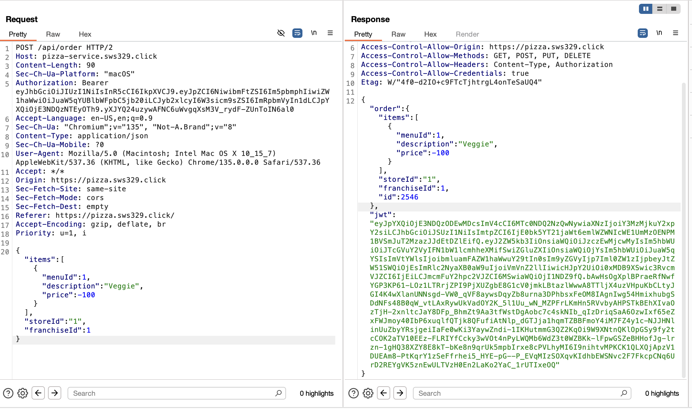

# Penetration Report

This report was completed by **Kristian Green** and **Spencer Summerhays** after their respective self and peer penetration tests. Several vulnerabilities were found in both websites and changes were made to address those issues.

## Self Attacks
### Kristian Green

| Item           | Result                                                                         |
| -------------- | ------------------------------------------------------------------------------ |
| Date           | June 12, 2025                                                                 |
| Target         | https://pizza.kristian-green-byu.click/                                                       |
| Classification | Identification and Authentication Failures                                                                      |
| Severity       | 3                                                                              |
| Description    | Registration doesn't stop users from registering an account that uses the same email or password as another user. However, it doesn't overwrite the preexisting user.
| Images         |    Registered with a@jwt.com (which was in use) and the current password of that user. |
| Corrections    | Changed the register router to check if the email exists in the database before allowing users to register.                                                          |

---

| Item           | Result                                                                         |
| -------------- | ------------------------------------------------------------------------------ |
| Date           | June 12, 2025                                                                 |
| Target         | https://pizza.kristian-green-byu.click/                                                       |
| Classification | Identification and Authentication Failures                                                                      |
| Severity       | 2                                                                              |
| Description    | There is no protection against brute force attacks because users are not throttled for making too many requests. Therefore, the administrator account was accessed, and an attack could destroy or obtain user information with its authorization. A dedicated attack could even bring down the website through DDOS.
| Images         |    Used a brute force attack to access the admin account. |
| Corrections    | Used the express rate limit package to not allow more than 10 authentication requests per 15 minutes per IP.  |

---

| Item           | Result                                                                         |
| -------------- | ------------------------------------------------------------------------------ |
| Date           | June 12, 2025                                                                 |
| Target         | https://pizza.kristian-green-byu.click/                                                       |
| Classification | Broken Access Control Failures                                                                      |
| Severity       | 4                                                                              |
| Description    | The update user endpoint is usable by non admin users. Potentially, this is intended, but for my vision of the website in its current state, only admins should be able to use the update endpoint until functionality to change a user’s password is implemented with more controlled inputs because users can use the input to change their email to unsafe values. If the endpoint should always be usable by non-admin users, the endpoint needs overhall to sanitize inputs. I didn't list this as an issue in the peer attack because it could be intended for non-administrators to use this endpoint.
| Images         |    Used the update endpoint as a non-administrator user. |
| Corrections    | Changed the conditional in the router code to ensure that only admin users can use the endpoint.  |

---

| Item           | Result                                                                         |
| -------------- | ------------------------------------------------------------------------------ |
| Date           | June 12, 2025                                                                 |
| Target         | https://pizza.kristian-green-byu.click/                                                       |
| Classification | Injection                                                                       |
| Severity       | 2                                                                              |
| Description    | The updateUser endpoint is vulnerable to SQL injection from the email field. I was able to see several pieces of information about the SQL database; however, I didn’t make a catastrophic query. A skilled attacker could likely take advantage of this vulnerability and obtain any information from the database or even drop it, breaking the website in the process. |
| Images         |    Incorrectly entered the email field, resulting in a SQL injection.
| Corrections    | Changed the database.js code for the Update endpoint to sanitize inputs. I also preemptively sanitized inputs for getUserFranchises in case users attempt to exploit that endpoint with a similar attack after obtaining admin access.  |

---

### Spencer Summerhays

| Item           | Result                                                                         |
| -------------- | ------------------------------------------------------------------------------ |
| Date           | June 12, 2025                                                                 |
| Target         | https://pizza.sws329.click/                                                       |
| Classification | Inproper Input Validation                                                                    |
| Severity       | 3                                                                              |
| Description    | Order request with a negative price was successful and not only returned a valid jwt pizza despite the negative price, but it also lowered the franchise revenue by the amount of money in the request, effectively allowing someone to not only steal jwts but also money.
| Images         |    Made a successful request with a verifiable jwt pizza despite having a negative price.         Revenue indeed goes down by 100 bitcoin per the negative price request|
| Corrections    | Added validation on price so that if the request price is changed from the original prices of the pizzas, the request will not succeed.                                                      |

---
---
## Peer Attacks
### Attack on Spencer Summerhays by Kristian Green

| Item           | Result                                                                         |
| -------------- | ------------------------------------------------------------------------------ |
| Date           | June 14, 2025                                                                 |
| Target         | https://pizza.sws329.click/                                                    |
| Classification | Identification and Authentication Failures                                                                      |
| Severity       | 3                                                                              |
| Description    | The register endpoint allows users to register for email that already is in use. This could be a potential security risk. However, thankfully, it doesn’t overwrite the other accounts in the database. I also verified that this works even if I didn’t know there was an admin account by making a new account with the email t@jwt.com and registering twice with that email. |
| Images         |    Registered with a@jwt.com (which was in use), and it made a new user. |

---

| Item           | Result                                                                         |
| -------------- | ------------------------------------------------------------------------------ |
| Date           | June 14, 2025                                                                 |
| Target         | https://pizza.sws329.click/                                                    |
| Classification | Injection                                                               |
| Severity       | 2                                                                              |
| Description    | The updateUser endpoint is vulnerable to SQL injections. I only got it to display basic SQL messages like “you have an error in your SQL syntax,” but it’s clear from that error message alone that attackers could use the updateUser endpoint to send SQL commands to the database that could leak user information or even delete the whole database in the case of a more experienced attacker. |
| Images         |    Injected SQL code in the email field of the updateUser endpoint. |

---

| Item           | Result                                                                         |
| -------------- | ------------------------------------------------------------------------------ |
| Date           | June 14, 2025                                                                 |
| Target         | https://pizza.sws329.click/                                                    |
| Classification | Identification and Authentication Failures                                                               |
| Severity       | 2                                                                              |
| Description    | Website appears to be vulnerable to brute force attacks because users are allowed to attempt authentication extremely often. I only sent around 74 requests in about 5 seconds to not incur high charges, but it’s clear that, given enough time, any user with an email that is known (possibly leaked from a SQL injection) could be cracked with brute force if they have poor passwords and there isn't eventual throttling. However, users with secure passwords are mostly protected from this because it would take an absurd amount of time to crack their passwords using brute force. Also, the brute force attack could result in DDOS if it’s never throttled. |
| Images         |    Used bruteforce to discover the simple password of a fake user. A total of 74 requests were made without throttling. |

---

### Attack on Kristian Green by Spencer Summerhays

| Item           | Result                                                                         |
| -------------- | ------------------------------------------------------------------------------ |
| Date           | April 15, 2025                                                                 |
| Target         | https://pizza.kristian-green-byu.click                                            |
| Classification | Inproper Input Validation                                                                      |
| Severity       | 3                                                                              |
| Description    | The order endpoint allows for the request to be changed without validating anything in the request body. For instance, I was able to make an order request with a negative request and obtain a new jwt pizza as well as lower the website's revenue |
| Images         |    Changed price in request to -1 in order to steal 1 bitcoin from the website as well as get a free jwt pizza. |

---

---
# Combined Summary of Learnings

The main takeaway we had as we performed these penetration attacks on our own and eachother's websites was the importance of security testing. It's very easy to feel as if your website is secure, when in fact it is vulnerable to critical attacks. One specific thing we learned is the importance of validating input. For example, both websites were vulnerable to the price being changed in an order request, and both websites were vulnerable to registering users on top of existing users, along with other validation problems. Thus by focusing on ensuring that any user input is sanitized or validated, we can eliminate many security vulnerabilities.
